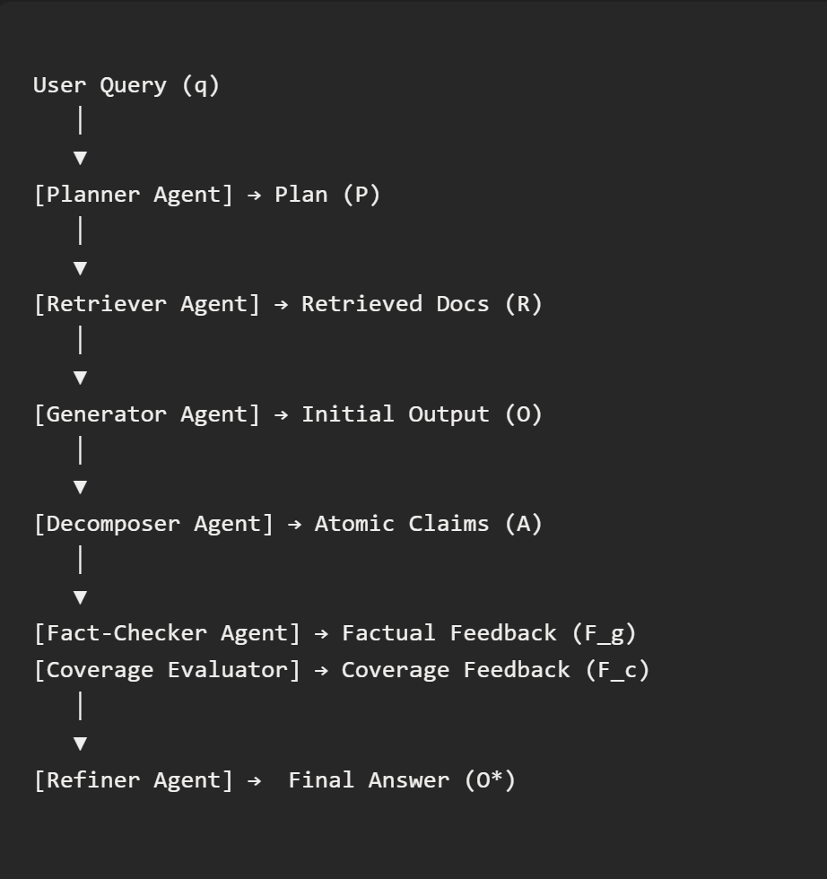

# System Architecture

This document provides complete technical documentation of the Diverse Text Generation multi-agent RAG system.

## Table of Contents

1. [System Overview](#system-overview)
2. [Architecture Details](#architecture-details)
3. [Agent Descriptions](#agent-descriptions)
4. [Termination Logic](#termination-logic)
5. [Technical Implementation](#technical-implementation)

---

## System Overview

DiverseTextGen is an **iterative multi-agent RAG (Retrieval-Augmented Generation) system** built with LangGraph that generates diverse, comprehensive, and factually accurate responses through iterative refinement.

### Core Design Principles

- **Iterative Refinement**: Continuously improves answers based on quality feedback
- **Quality-Controlled**: Automatically terminates when quality criteria are met
- **Parallel Execution**: Agents 5 & 6 run concurrently (40-50% faster)
- **Memory-Bounded**: Safety termination when RAM/GPU limits reached

### The 6-Agent Pipeline

```
Query → [1] Planner → [2] Retriever → [3] Synthesizer → [4] Fact Extractor
                                                              ↓
                                                    ┌─────────┴─────────┐
                                                    ↓                   ↓
                                              [5] Verifier    [6] Coverage Evaluator
                                                    └─────────┬─────────┘
                                                              ↓
                                                      Iteration Gate
                                                              ↓
                                                  Check Quality & Memory
                                                              ↓
                                                  [Continue or Terminate]
```



### Key Features

✅ **Automatic Iteration** - Runs until quality thresholds met  
✅ **Parallel Execution** - 40-50% faster with concurrent verification  
✅ **Smart Termination** - Quality-based (primary) + memory-based (safety)  
✅ **Dense Retrieval** - FAISS + sentence transformers  
✅ **ICAT Evaluation** - Atomic claim verification

---

## Architecture Details

### LangGraph Workflow

The system is implemented as a **StateGraph** in LangGraph with conditional routing for iteration control.

```python
# Workflow structure
workflow = StateGraph(RAGState)

# Nodes (agents)
workflow.add_node("planner", planner_node)
workflow.add_node("retriever", retriever_node)
workflow.add_node("synthesizer", synthesizer_node)
workflow.add_node("fact_extractor", fact_extractor_node)
workflow.add_node("parallel_evaluation", parallel_evaluation_node)
workflow.add_node("iteration_gate", iteration_gate_node)

# Flow: Entry → Sequential → Parallel → Gate → (Loop or End)
workflow.set_entry_point("planner")
workflow.add_edge("planner", "retriever")
workflow.add_edge("retriever", "synthesizer")
workflow.add_edge("synthesizer", "fact_extractor")
workflow.add_edge("fact_extractor", "parallel_evaluation")
workflow.add_edge("parallel_evaluation", "iteration_gate")

# Conditional routing
workflow.add_conditional_edges(
    "iteration_gate",
    should_continue_routing,
    {"continue": "planner", "end": END}
)
```

### State Management

The system uses a **TypedDict** state schema (`RAGState`) that flows through all nodes:

```python
class RAGState(TypedDict):
    # Query and control
    query_id: str
    query: str
    iteration: int
    
    # Budget tracking (memory constraints only)
    budget: Dict[str, Any]
    
    # Agent outputs
    plan: List[Dict[str, str]]           # Query decomposition aspects
    retrieval: List[Dict[str, Any]]      # Retrieved documents per aspect
    answer: str                           # Generated answer
    atomic_facts: List[str]               # Extracted atomic facts
    factual_feedback: Dict[str, Any]      # From Verifier
    coverage_feedback: Dict[str, Any]     # From Coverage Evaluator
    
    # History and termination
    history: List[Dict]                   # Iteration history
    should_continue: bool                 # Continue/terminate flag
    termination_reason: Optional[str]     # Why system stopped
    
    # Metadata
    timestamps: Dict[str, float]          # Performance tracking
    error_log: List[str]                  # Error tracking
```

**Key Design Notes:**
- State is **manually managed** (no `Annotated[..., add]` reducers) to avoid accumulation bugs
- History is explicitly appended in `iteration_gate_node`
- All nodes read from and write to specific state fields

### Node Architecture

Agents (business logic) are separated from Nodes (LangGraph wrappers):

- **`agents/`**: Pure functions with no LangGraph dependencies
- **`nodes/`**: Thin wrappers that handle state I/O

**Example:**
```python
# Agent (pure function)
def generate_initial_plan(query: str) -> List[Dict]:
    # Business logic
    return plan

# Node (LangGraph wrapper)
def planner_node(state: RAGState) -> RAGState:
    query = state["query"]
    plan = generate_initial_plan(query)  # Call agent
    return {"plan": plan}  # Return state update
```


---

## Agent Descriptions

### Agent 1: Planner

**Purpose:** Decomposes queries into aspects/perspectives and refines based on feedback

**Modes:**
1. **Initial Planning** (iteration 0): Generate initial query decomposition
2. **Plan Refinement** (iteration 1+): Refine based on factual and coverage feedback

**Input:**
- Query (initial)
- Current plan, factual feedback, coverage feedback (refinement)

**Output:**
- List of aspects with query, aspect name, and reason

**Key Logic:**
- Identifies missing salient points (high priority)
- Addresses refuted facts with exclusion instructions
- Enhances unclear facts with better evidence targeting
- Maximum 7 aspects to maintain focus

**LLM Configuration:**
- Temperature: 0.7
- Max tokens: 512
- Model: Qwen/Qwen3-4B-Instruct-2507

### Agent 2: Retriever

**Purpose:** Dense retrieval of relevant documents for each aspect

**Implementation:**
- **Embedding Model:** Snowflake/snowflake-arctic-embed-l
- **Index:** FAISS for efficient similarity search
- **Strategy:** Top-k documents per aspect (default k=5)

**Input:**
- Query decomposition plan (aspects)

**Output:**
- List of retrieved documents per aspect with relevance scores

**Key Features:**
- Batch embedding computation
- Cached embeddings for efficiency
- Aspect-specific retrieval

### Agent 3: Synthesizer

**Purpose:** Generates comprehensive answers from plan and retrieved documents

**Input:**
- Original query
- Query decomposition plan
- Retrieved documents per aspect

**Output:**
- Generated answer text

**Key Logic:**
- Synthesizes information from multiple aspects
- Integrates evidence from retrieved documents
- Maintains comprehensiveness and coherence

**LLM Configuration:**
- Temperature: 0.7
- Max tokens: 512

### Agent 4: Fact Extractor

**Purpose:** Extracts atomic facts from generated answers

**Input:**
- Generated answer

**Output:**
- List of atomic facts (simple, verifiable claims)

**Key Logic:**
- Breaks down complex statements into atomic units
- Each fact should be independently verifiable
- Used for fact verification in next step

### Agent 5: Verifier

**Purpose:** Verifies extracted facts against retrieved evidence

**Input:**
- Atomic facts (from Agent 4)
- Retrieved documents (from Agent 2)
- Original query

**Output:**
- Factual feedback dictionary with:
  - **stats**: `{total_facts, supported, refuted, unclear}`
  - **written_feedback**: Detailed feedback on problematic facts
  - **no_improvements_needed**: Boolean flag

**Verification Categories:**
1. **Supported**: Fact has clear evidence in retrieved documents
2. **Refuted**: Fact contradicts retrieved evidence
3. **Unclear**: Insufficient evidence to verify

**LLM Configuration:**
- Temperature: 0.3 (lower for more deterministic verification)
- Max tokens: 256

### Agent 6: Coverage Evaluator

**Purpose:** Evaluates topic coverage and identifies gaps

**Input:**
- Original query
- Query decomposition plan
- Generated answer

**Output:**
- Coverage feedback dictionary with:
  - **missing_salient_points**: List of missing important topics
  - **aspect_coverage_details**: Per-aspect coverage status
  - **plan_quality**: Feedback on plan effectiveness
  - **no_improvements_needed**: Boolean flag

**Coverage Categories:**
- **well-covered**: Aspect thoroughly addressed
- **partially-covered**: Some information present
- **not-covered**: Aspect not addressed

### Parallel Execution Node

**Special node that runs Agents 5 & 6 concurrently:**

```python
async def run_both():
    verifier_task = asyncio.create_task(run_verifier_async(state))
    coverage_task = asyncio.create_task(run_coverage_async(state))
    results = await asyncio.gather(verifier_task, coverage_task)
    return results
```

**Performance Improvement:** 40-50% faster per iteration compared to sequential execution.

### Iteration Gate

**Purpose:** Decides whether to continue iterating or terminate

**Decision Logic (priority order):**

1. **Quality-based termination** (primary):
   - No refuted facts (strict requirement)
   - Unclear facts below threshold (≤15% OR ≤3 absolute)
   - Missing salient points ≤1
   - All aspects "well-covered"

2. **Memory-based termination** (safety):
   - RAM usage ≥ threshold (default 90%)
   - GPU memory ≥ threshold (default 90%)

**Output:**
- `should_continue`: Boolean
- `termination_reason`: String description
- Updated `iteration` counter
- Appended `history` entry

**Console Output:**
```
[Iteration Gate] EVALUATION
  Current iteration: 2
  Mode: Quality-controlled (memory-bounded)
  
  Quality Check:
    Facts: 45/50 supported, 0 refuted, 5 unclear (10%)
      → Refuted: ✓ OK (must be 0)
      → Unclear: ✓ OK (5 <= 15% OR 5 <= 3)
    Coverage: 1 missing salient points
      → Missing points: ✓ OK (1 <= 1)
    
[Iteration Gate] ✓ Quality complete - no further improvements needed - TERMINATING
```

---

## Termination Logic

### Primary: Quality-Based Termination

The system aims to produce **factually accurate and comprehensive** answers.

**Termination Criteria (all must be met):**

```python
def check_quality_termination(state):
    # 1. No refuted facts (strict)
    if refuted > 0:
        return False
    
    # 2. Unclear facts below threshold (lenient: percentage OR absolute)
    unclear_percent = (unclear / total_facts) * 100
    if not (unclear_percent <= 15.0 or unclear <= 3):
        return False
    
    # 3. Missing points below threshold
    if len(missing_salient_points) > 1:
        return False
    
    # 4. All aspects well-covered
    if not all(aspect["status"] == "well-covered" for aspect in aspects):
        return False
    
    return True
```

**Reasoning:**
- **Refuted facts = 0**: Ensures factual accuracy
- **Unclear facts lenient**: Some facts may lack evidence but don't contradict
- **Missing points ≤ 1**: Near-comprehensive coverage
- **Well-covered aspects**: Quality across all dimensions

### Secondary: Memory-Based Termination

**Safety mechanism** to prevent resource exhaustion.

```python
def check_memory_usage(max_ram_percent=90, max_gpu_percent=90):
    # Check RAM
    if psutil.virtual_memory().percent >= max_ram_percent:
        return False, f"RAM usage at {ram_percent}%"
    
    # Check GPU memory
    for i in range(torch.cuda.device_count()):
        gpu_percent = (allocated / total) * 100
        if gpu_percent >= max_gpu_percent:
            return False, f"GPU {i} memory at {gpu_percent}%"
    
    return True, "OK"
```

**Termination Reasons:**
- `quality_complete`: All quality metrics met ✅
- `quality_complete_by_agents`: Both agents indicate completion ✅
- `memory_exceeded: RAM usage at X%`: Safety termination ⚠️
- `memory_exceeded: GPU X memory at Y%`: Safety termination ⚠️

### Iteration History

Each iteration stores:
```python
{
    "iteration": int,
    "plan": List[Dict],      # Query decomposition
    "answer": str,           # Generated answer
    "timestamp": float       # Unix timestamp
}
```

Enables **post-hoc analysis** of how answers evolved.

---

## Technical Implementation

### File Structure

```
diverseTextGen/
├── state.py                   # RAGState schema (TypedDict)
├── graph.py                   # LangGraph workflow builder
├── llm_observability.py       # LLM decision tracking
├── requirements.txt           # Dependencies
├── env.example                # Environment template
│
├── config/
│   └── settings.py            # Configuration (paths, thresholds, models)
│
├── agents/                    # Pure agent implementations
│   ├── planner.py             # Agent 1
│   ├── retriever.py           # Agent 2
│   ├── synthesizer.py         # Agent 3
│   ├── fact_extractor.py      # Agent 4
│   ├── verifier.py            # Agent 5
│   └── coverage_evaluator.py  # Agent 6
│
├── nodes/                     # LangGraph node wrappers
│   ├── planner.py
│   ├── retriever.py
│   ├── synthesizer.py
│   ├── fact_extractor.py
│   ├── parallel_verification.py  # Parallel execution of 5 & 6
│   └── iteration_gate.py          # Termination logic
│
├── llm/
│   ├── server_llm.py          # vLLM server client
│   ├── hf_llm.py              # HuggingFace direct inference
│   └── prompts/               # Prompt templates
│
├── retrieval/
│   └── retriever.py           # Dense retrieval (FAISS + embeddings)
│
├── data/
│   ├── formatters.py          # Prompt formatting
│   └── dataset.py             # Data loading
│
├── eval/
│   ├── icat.py                # ICAT-A atomic claim evaluation
│   ├── experiment_tracker.py  # Experiment tracking
│   └── visualizer.py          # Result visualization
│
├── scripts/
│   ├── run_langgraph.py       # Main RAG runner
│   ├── run_full_experiment.py # Batch experiment runner
│   ├── run_baseline_experiment.py
│   ├── evaluate_icat.py       # ICAT evaluation script
│   └── shell/*.sh             # SLURM batch scripts
│
├── artifacts/                 # Generated outputs (gitignored)
│   ├── llm_decisions.jsonl    # LLM decision log
│   └── ...
│
└── docs/                      # Documentation
```

### Configuration

All settings centralized in `config/settings.py`:

**Key Settings:**

```python
# LLM Model
DEFAULT_MODEL = "Qwen/Qwen3-4B-Instruct-2507"

# Retrieval
EMBEDDING_MODEL = "Snowflake/snowflake-arctic-embed-l"
DEFAULT_TOP_K = 5

# Termination Thresholds
DEFAULT_MAX_RAM_PERCENT = 90
DEFAULT_MAX_GPU_PERCENT = 90

# Agent Parameters
PLANNER_TEMPERATURE = 0.7
PLANNER_MAX_TOKENS = 512
SYNTHESIZER_TEMPERATURE = 0.7
SYNTHESIZER_MAX_TOKENS = 512
VERIFIER_TEMPERATURE = 0.3
VERIFIER_MAX_TOKENS = 256
```

**Environment Variables:**
Set via `.env` file or export:
```bash
export RAG_DATA_DIR="./data"
export RAG_CORPUS_PATH="./data/antique/corpus_filtered_50.jsonl"
export RAG_SERVER_LOG_FILE="./server_logs/log.txt"
export RAG_MAX_RAM_PERCENT="90"
export RAG_MAX_GPU_PERCENT="90"
```

### Key Dependencies

```
# Core
torch>=2.0.0
transformers>=4.30.0
sentence-transformers>=2.2.0
faiss-cpu>=1.7.4

# LangGraph
langgraph>=0.0.40
langgraph-checkpoint-sqlite>=0.0.1

# LLM Server
vllm>=0.2.0

# Data
datasets>=2.14.0
numpy>=1.24.0
pandas>=2.0.0

# Utilities
jsonlines>=3.1.0
psutil>=5.9.0

# Visualization
matplotlib>=3.7.0
seaborn>=0.12.0
```

### LLM Server Setup

The system requires a running vLLM server:

**Start server:**
```bash
python -m vllm.entrypoints.openai.api_server \
    --model Qwen/Qwen3-4B-Instruct-2507 \
    --host 0.0.0.0 \
    --port 8000
```

**Server log format** (`server_logs/log.txt`):
```
hostname
port
```

**Client initialization:**
```python
from llm.server_llm import ServerLLM, load_url_from_log_file

url = load_url_from_log_file()  # Reads server_logs/log.txt
llm = ServerLLM(base_url=url, model=DEFAULT_MODEL)
```

### Performance Characteristics

**Per Iteration:**
- Planner: ~2-3s
- Retriever: ~1-2s
- Synthesizer: ~3-4s
- Fact Extractor: ~1-2s
- Parallel Evaluation: ~4-5s (vs ~8-10s sequential)
- **Total: ~12-17s per iteration** (with parallel execution)

**Typical Convergence:**
- Simple queries: 1-2 iterations
- Complex queries: 3-5 iterations
- Maximum: Configurable (default: no limit, quality-controlled)

**Memory Usage:**
- Base: ~4GB RAM
- Per iteration: +500MB-1GB
- GPU: Model size + embeddings (~8-12GB for Qwen3-4B)

---

## Summary

The DiverseTextGen system implements a sophisticated iterative RAG pipeline with:

✅ **6 specialized agents** working in concert  
✅ **Parallel execution** for performance  
✅ **Quality-driven termination** for accuracy  
✅ **Memory-safe operation** with monitoring  
✅ **Modular architecture** for maintainability  
✅ **Comprehensive evaluation** with ICAT  

The system automatically balances factual accuracy and topic coverage through iterative refinement, producing high-quality, comprehensive answers.

For usage instructions, see [USAGE.md](USAGE.md).  
For observability features, see [OBSERVABILITY.md](OBSERVABILITY.md).

